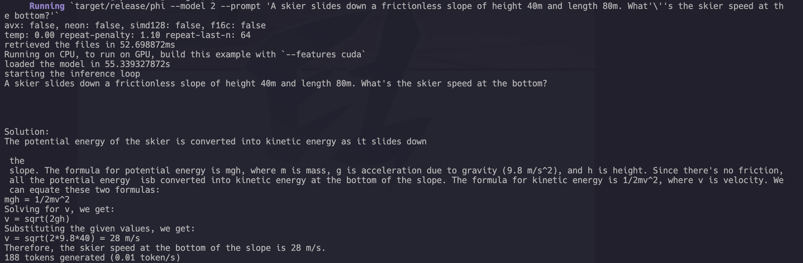
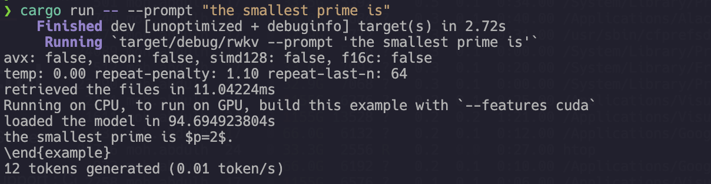
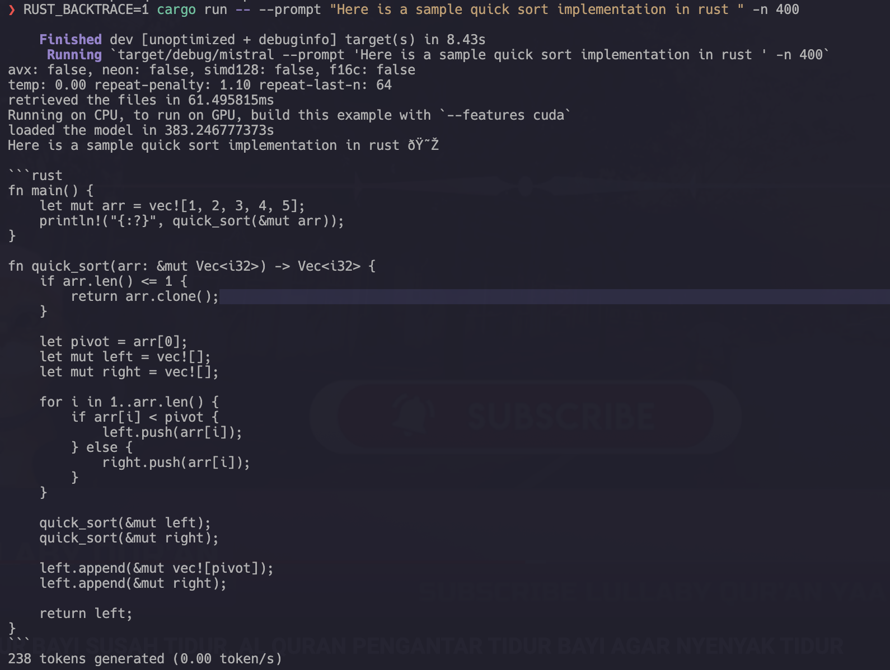

# Belajar Hugging Face

## Hugging Face Candle
Candle adalah toolkit yang dirancang untuk memfasilitasi proses pelatihan dan penyetelan model machine learning, terutama model bahasa alami, menggunakan Transformers. ->
[doucmentation](https://huggingface.github.io/candle/index.html)

"Hugging Face" adalah perusahaan yang mengembangkan perangkat lunak untuk pemrosesan bahasa alami dan pembelajaran mesin. "Candle-Phi" adalah salah satu proyek yang mereka kembangkan.

CANDLE (Continuous Active Learning for Digital Evidence) adalah sebuah inisiatif yang bertujuan untuk mengembangkan alat-alat otomatis untuk menganalisis dan memahami bukti digital dalam kasus hukum, seperti dokumen, catatan medis, dan lainnya.

## Other Resource

### phi

source -> [phi](https://github.com/mymyid/phi)
#### Run Code
```phi
cargo run --release -- --model 2  --prompt "A skier slides down a frictionless slope of height 40m and length 80m. What's the skier speed at the bottom?"
```


### rwkv

source -> [rwkv](https://github.com/mymyid/rwkv)
#### Run Code
```rwkv
cargo run -- --prompt "the smallest prime is"
```


### mistral

source -> [mistral](https://github.com/mymyid/mistral)
#### Run Code
```mistral
RUST_BACKTRACE=1 cargo run --features cuda -- --prompt "Here is a sample quick sort implementation in rust " -n 400
```

